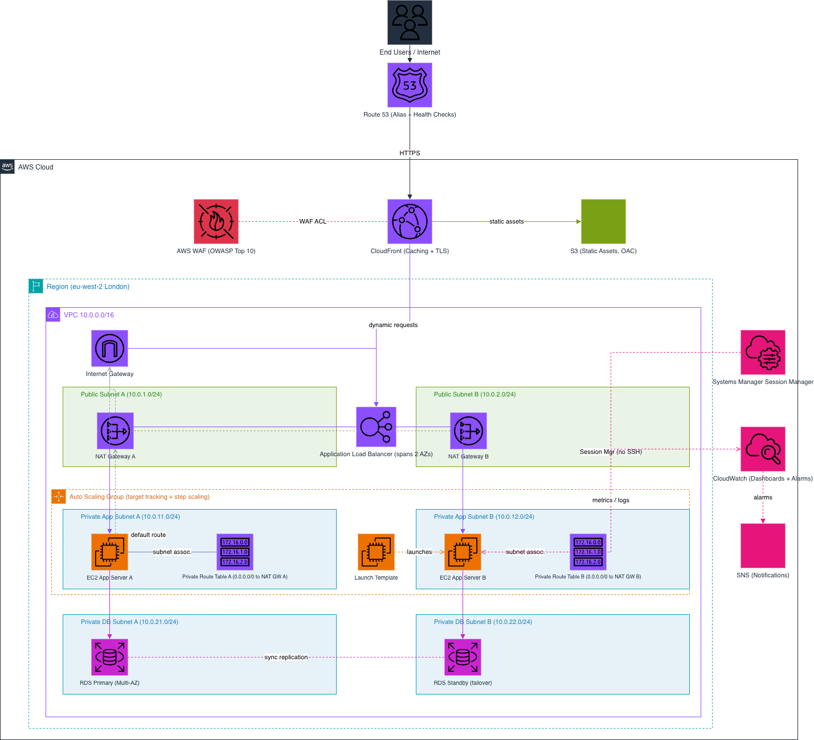

# Scalable Web Application on AWS with ALB and Auto Scaling

This repo holds the design and documentation for a production style web application running on AWS. The goal was to build something that stays online even when things go wrong, grows on its own when traffic goes up, and keeps the servers and the database safe inside private parts of the network.

The whole thing runs on EC2 instances that sit behind an Application Load Balancer, scale up and down with an Auto Scaling Group, and talk to a database that has a backup copy ready in a second Availability Zone. Static files are served fast through CloudFront, and the front door is protected by AWS WAF.

## Table of Content

- [The Idea Behind the Project](#the-idea-behind-the-project)
- [Architecture Diagram](#architecture-diagram)
- [How a Request Travels Through the System](#how-a-request-travels-through-the-system)
- [The Network Setup](#the-network-setup)
- [Routing and the NAT Gateways](#routing-and-the-nat-gateways)
- [Staying Online Across Two Zones](#staying-online-across-two-zones)
- [Scaling Up and Down on Its Own](#scaling-up-and-down-on-its-own)
- [Keeping the Application Safe](#keeping-the-application-safe)
- [Reaching the Servers Without a Bastion](#reaching-the-servers-without-a-bastion)
- [Watching the System and Getting Alerts](#watching-the-system-and-getting-alerts)
- [AWS Services Used](#aws-services-used)
- [What I Learned From This](#what-i-learned-from-this)

## The Idea Behind the Project

A lot of small projects put everything on one server. That works until the server dies or until too many people show up at the same time. This project takes the opposite path. Every important piece has a copy in a second Availability Zone, the compute layer can add or remove servers by itself, and nothing that matters is left sitting in a public place where anyone can reach it.

So the main ideas are simple:

- Spread the work across two Availability Zones so one zone failing does not take the site down.
- Put the load balancer in public subnets and keep the servers and the database in private subnets.
- Let the Auto Scaling Group decide how many servers to run based on real load.
- Cache static content at the edge with CloudFront so users get it fast and the servers do less work.
- Lock the network down with WAF, security groups, and network ACLs.

## Architecture Diagram

## How a Request Travels Through the System

Here is the path a normal request takes from the user all the way to the database and back:

1. The user types the domain name. Route 53 answers and sends them to CloudFront.
2. CloudFront checks its cache. If the file is static, like an image or a CSS file, it serves it straight from the edge or from the S3 bucket. The user never reaches the servers for these files.
3. If the request needs real work, like a login or a search, CloudFront passes it on. AWS WAF checks the request first and blocks anything that looks like a common attack.
4. The request lands on the Application Load Balancer, which is sitting in the public subnets across both zones.
5. The load balancer picks a healthy EC2 server in one of the private subnets and forwards the request to it.
6. The server runs the logic and talks to the RDS database to read or write data.
7. The answer travels back the same way to the user.

When a server needs to reach the internet itself, for example to download an update, it does not go straight out. It follows its route table to the NAT Gateway in its own zone, and the NAT Gateway sends the traffic out through the Internet Gateway.

## The Network Setup

Everything lives inside one VPC with the range `10.0.0.0/16`. Inside the VPC there are six subnets, split evenly across two Availability Zones:

| Subnet type | Zone A | Zone B | What lives here |
|---|---|---|---|
| Public subnet | 10.0.1.0/24 | 10.0.2.0/24 | Load balancer and NAT Gateway |
| Private app subnet | 10.0.11.0/24 | 10.0.12.0/24 | EC2 web and app servers |
| Private database subnet | 10.0.21.0/24 | 10.0.22.0/24 | RDS primary and standby |

The public subnets are the only ones that can talk to the internet directly. The app servers and the database have no public address at all, so nobody on the internet can connect to them. This is one of the most important parts of the design.

## Routing and the NAT Gateways

Each zone has its own NAT Gateway and its own private route table. This is on purpose.

The public subnets share a route table that sends internet traffic (`0.0.0.0/0`) to the Internet Gateway. The private app subnets each point to the NAT Gateway in the same zone. So the app server in Zone A uses NAT Gateway A, and the app server in Zone B uses NAT Gateway B.

I chose one NAT per zone instead of one shared NAT for two reasons. First, if a single NAT goes down, only one zone loses its outbound internet, not both. Second, traffic stays inside its own zone, so there is no extra charge for data crossing between zones during normal work.

The database subnets do not get an internet route by default. A database should not be reaching out to the internet, so it only keeps the local VPC route. If patching ever needs outbound access, a route to the NAT can be added later.

## Staying Online Across Two Zones

High availability here is not one feature. It is the same pattern repeated at every layer:

- The load balancer spans both public subnets, so it keeps working if one zone has trouble.
- The Auto Scaling Group launches servers in both private app subnets, so the compute is never stuck in a single zone.
- RDS runs in Multi-AZ mode. There is a primary database in one zone and a standby copy in the other. AWS keeps them in sync, and if the primary fails, RDS switches to the standby on its own.

If a whole Availability Zone goes down, the site keeps serving from the other one.

## Scaling Up and Down on Its Own

The Auto Scaling Group uses a Launch Template that describes how each server should look: the AMI, the instance type, the startup script, and the IAM role.

Scaling is handled in two ways:

- Target tracking keeps an eye on average CPU. If it crosses the target, the group adds servers. When things calm down, it removes the extra ones.
- Step scaling can react harder to bigger jumps, adding more than one server at a time when the load spikes fast.

The result is that the number of servers follows the real traffic. You pay for what you need and the site does not slow down when a crowd shows up.

## Keeping the Application Safe

Security is built in layers, so even if one layer is passed, the next one is still there:

- **AWS WAF** sits in front and blocks common web attacks from the OWASP Top 10 before they reach anything.
- **Security groups** follow a chain. The load balancer only accepts web traffic, the servers only accept traffic coming from the load balancer, and the database only accepts traffic coming from the servers. Each layer trusts only the layer right before it.
- **Network ACLs** add a second, broader filter at the subnet level.
- **Private subnets** mean the servers and the database simply have no public address to attack.

Here is the security group chain in short:

| Security group | Accepts traffic from | On port |
|---|---|---|
| Load balancer | CloudFront | 443 (HTTPS) |
| App servers | Load balancer group only | App port (for example 8080) |
| Database | App servers group only | 3306 or 5432 |

## Reaching the Servers Without a Bastion

A normal way to log into private servers is to run a small public jump server, called a bastion host, and SSH through it. That is one more thing to manage and one more thing that can be attacked.

Instead, this project uses AWS Systems Manager Session Manager. The servers run the SSM agent and have the right IAM role, so I can open a secure shell into them straight from the AWS console or the CLI. No open SSH port, no public jump server, and every session can be logged. It is cleaner and safer.

## Watching the System and Getting Alerts

CloudWatch collects metrics and logs from the load balancer, the servers, the Auto Scaling Group, and the database. A dashboard shows the health of the whole system in one place.

On top of that, CloudWatch alarms watch for trouble, like high CPU, unhealthy servers, or a database running low on storage. When an alarm goes off, it sends a message to an SNS topic, and SNS emails me right away. So I find out about a problem instead of waiting for a user to report it.

## AWS Services Used

| Service | Why it is here |
|---|---|
| VPC | The private network that holds everything |
| EC2 and Auto Scaling | The web and app servers, plus the logic that scales them |
| Application Load Balancer | Spreads traffic across healthy servers in both zones |
| AWS WAF | Blocks common web attacks at the front door |
| CloudFront | Caches static files close to users for speed |
| S3 | Stores the static assets that CloudFront serves |
| RDS Multi-AZ | The database with an automatic backup copy |
| Route 53 | Maps the domain name to the load balancer and checks health |
| Systems Manager | Secure shell access without a bastion host |
| CloudWatch and SNS | Dashboards, alarms, and email notifications |

## What I Learned From This

Building this taught me how the pieces of a real AWS setup fit together instead of standing alone:

- How to lay out a VPC with public and private subnets, route tables, and NAT Gateways that make sense.
- How to design across two Availability Zones so the system survives a zone failure.
- How to set up load balancer listener rules and target group health checks.
- How Auto Scaling really reacts to load with target tracking and step scaling.
- How to protect an application with WAF, careful security groups, and private subnets.
- How to drop the old bastion host and use Session Manager instead.

The big lesson is that high availability and security are not single switches you turn on. They come from a lot of small, correct choices stacked on top of each other.
